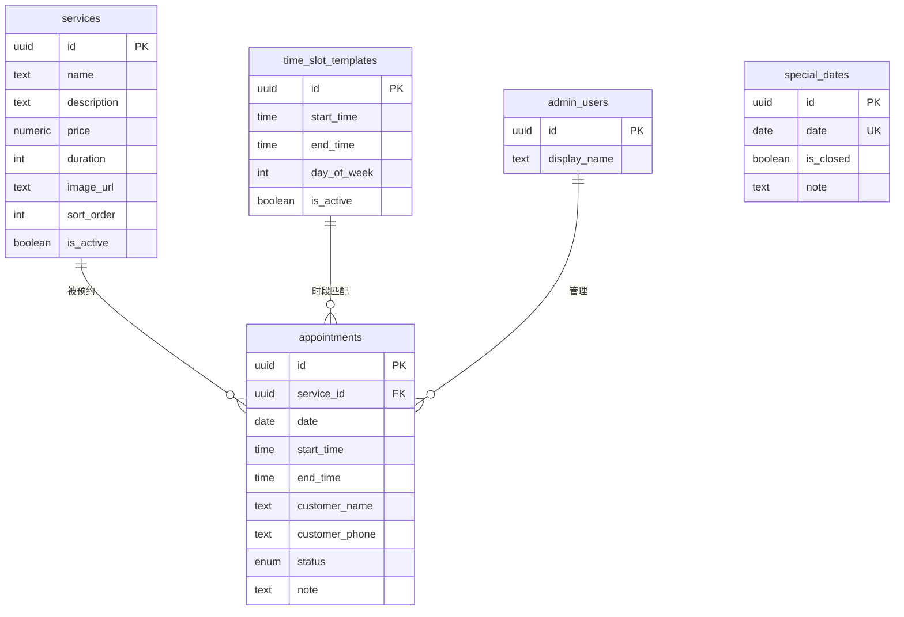
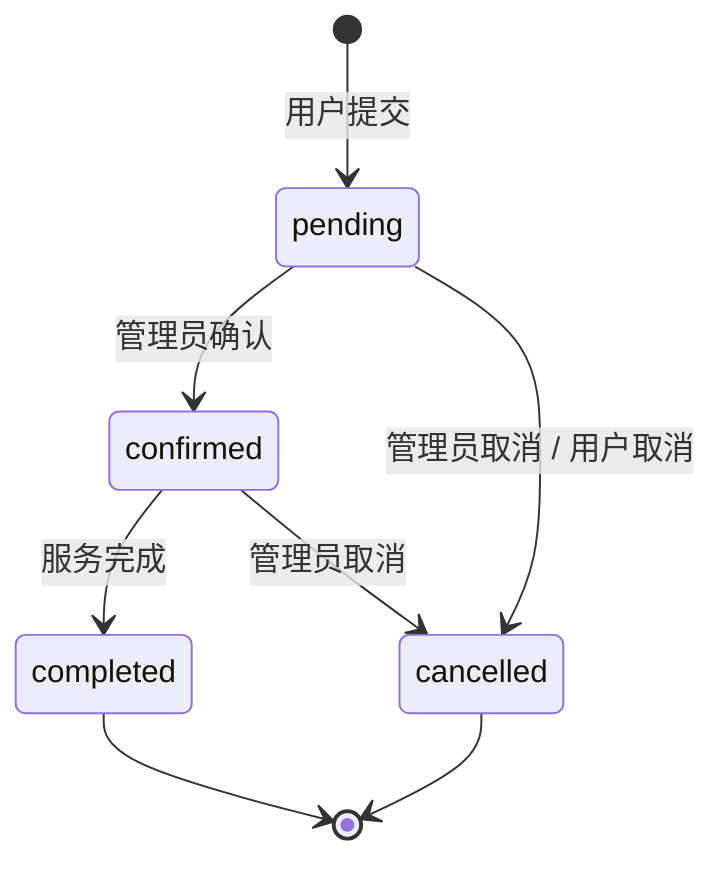

# 美甲预约系统 — 数据库设计说明

## ER 关系图



## 表说明

| 表名 | 用途 | 记录量级 |
|------|------|----------|
| `services` | 美甲项目（名称、价格、时长、封面） | 个位数 ~ 数十 |
| `time_slot_templates` | 每日可预约时段模板 | 20 条左右 |
| `special_dates` | 节假日闭店 / 特殊安排 | 按需 |
| `appointments` | 用户预约记录（核心） | 随业务增长 |
| `admin_users` | 管理员（关联 Supabase Auth） | 1 ~ 5 |

## 预约状态流转



| 状态 | 中文 | 说明 |
|------|------|------|
| `pending` | 待确认 | 用户刚提交，等待店家确认 |
| `confirmed` | 已确认 | 店家已确认，等待到店 |
| `completed` | 已完成 | 服务已完成 |
| `cancelled` | 已取消 | 预约取消，时段释放 |

## 可用时段计算逻辑

```
输入: 目标日期 date
输出: 该日所有时段 + 是否可预约

1. 查 special_dates → 若 is_closed = true，返回空
2. 查 time_slot_templates → 过滤 day_of_week 匹配的模板
3. 对每个模板时段，查 appointments
   → 若存在 status != 'cancelled' 的同 date + start_time 记录，标记为不可用
4. 过滤掉过去的时段（date = 今天时，start_time <= 当前时间）
5. 返回可用列表
```

数据库层通过 `get_available_slots(date)` 函数实现，API 层直接调用。

## 关键约束

1. **防重复预约**：`(date, start_time)` 唯一索引，排除 `cancelled` 状态
2. **手机号校验**：`customer_phone` 必须匹配 11 位数字
3. **时段有效性**：`end_time > start_time`
4. **RLS 策略**：
   - 匿名用户：可读 services / 时段模板，可 INSERT 预约
   - 管理员（admin_users）：appointments / services 全部 CRUD

## API 与数据库映射

| API 端点 | 方法 | 数据库操作 |
|----------|------|-----------|
| `/api/services` | GET | `SELECT * FROM services WHERE is_active` |
| `/api/availability?date=` | GET | `SELECT * FROM get_available_slots($date)` |
| `/api/appointments` | POST | `INSERT INTO appointments ...` |
| `/api/admin/appointments` | GET | `SELECT a.*, s.name FROM appointments a JOIN services s ...` |
| `/api/admin/appointments/[id]` | PATCH | `UPDATE appointments SET status = $1` |
| `/api/admin/appointments/[id]` | DELETE | `DELETE FROM appointments WHERE id = $1` |

## 索引策略

| 索引 | 列 | 用途 |
|------|-----|------|
| `idx_appointments_slot_unique` | `(date, start_time) WHERE status != 'cancelled'` | 防重复预约 |
| `idx_appointments_date` | `date` | 按日期查询 |
| `idx_appointments_status` | `status` | 后台状态筛选 |
| `idx_appointments_phone` | `customer_phone` | 按手机号查找 |

## 环境变量

```env
NEXT_PUBLIC_SUPABASE_URL=https://xxx.supabase.co
NEXT_PUBLIC_SUPABASE_ANON_KEY=eyJ...
SUPABASE_SERVICE_ROLE_KEY=eyJ...        # 仅服务端 API 使用
```

## 部署步骤

1. 在 Supabase Dashboard 创建项目
2. 在 SQL Editor 执行 `supabase/schema.sql`
3. 在 Authentication 创建管理员账号
4. 在 `admin_users` 表插入对应记录
5. 配置 `.env.local` 环境变量
