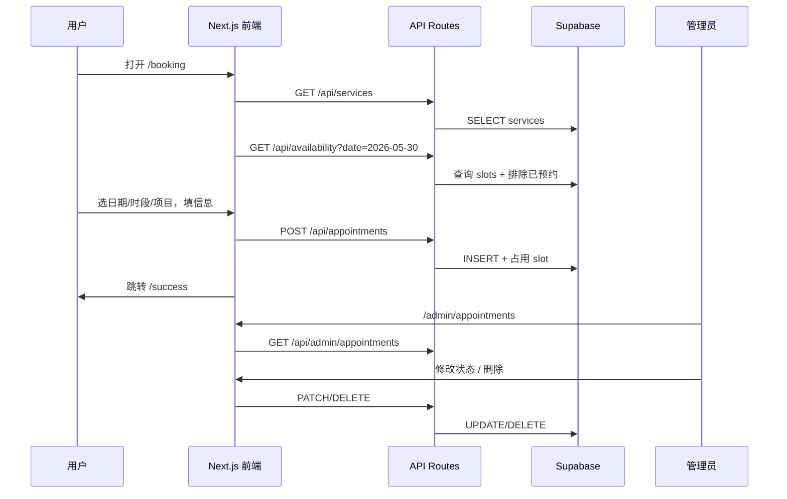

# 美甲预约系统 — 页面结构

## 技术栈

| 层级 | 技术 |
|------|------|
| 框架 | Next.js 14 (App Router) |
| 样式 | TailwindCSS |
| 数据库 | Supabase (PostgreSQL) |
| 认证 | Supabase Auth（仅后台管理员） |

## 路由结构

```
app/
├── layout.tsx                    # 全局布局：奶油粉白主题、字体、底部导航
├── page.tsx                      # 用户首页 → 重定向到 /booking
├── globals.css                   # 奶油风 CSS 变量
│
├── (user)/                       # 用户端路由组（无登录）
│   ├── layout.tsx                # 用户端布局：顶部品牌栏 + 内容区
│   ├── booking/
│   │   └── page.tsx              # 预约主页面（核心流程）
│   └── success/
│       └── page.tsx              # 预约成功页
│
├── admin/
│   ├── layout.tsx                # 后台布局：侧边栏/顶栏 + 鉴权守卫
│   ├── login/
│   │   └── page.tsx              # 管理员登录
│   └── appointments/
│       └── page.tsx              # 预约管理列表
│
└── api/
    ├── availability/
    │   └── route.ts              # GET 未来30天可预约时段
    ├── services/
    │   └── route.ts              # GET 美甲项目列表
    ├── appointments/
    │   └── route.ts              # POST 创建预约
    └── admin/
        └── appointments/
            ├── route.ts          # GET 全部预约
            └── [id]/
                └── route.ts      # PATCH 状态 / DELETE 删除
```

## 用户端页面详情

### `/booking` — 预约主页面（单页多步骤）

移动端优先，类似小红书卡片流布局，奶油粉白配色。

```
┌─────────────────────────────────┐
│  ✨ 指尖美学 · Nail Studio      │  ← Header（品牌 + 副标题）
├─────────────────────────────────┤
│  📅 选择日期                     │
│  ┌───┐ ┌───┐ ┌───┐ ┌───┐       │  ← 横向滚动日期条（未来30天）
│  │ 29│ │ 30│ │ 31│ │ 1 │ ...   │
│  └───┘ └───┘ └───┘ └───┘       │
├─────────────────────────────────┤
│  ⏰ 选择时段                     │
│  ┌──────┐ ┌──────┐ ┌──────┐    │  ← 时段网格（仅显示 available）
│  │10:00 │ │10:30 │ │11:00 │    │
│  └──────┘ └──────┘ └──────┘    │
├─────────────────────────────────┤
│  💅 选择项目                     │
│  ┌─────────────────────────┐   │
│  │ 🌸 纯色美甲    ¥88  60min│   │  ← 项目卡片（图片 + 名称 + 价格 + 时长）
│  └─────────────────────────┘   │
│  ┌─────────────────────────┐   │
│  │ ✨ 法式美甲   ¥128  90min│   │
│  └─────────────────────────┘   │
├─────────────────────────────────┤
│  📝 填写信息                     │
│  姓名  [________________]       │
│  手机  [________________]       │
├─────────────────────────────────┤
│  ┌─────────────────────────┐   │
│  │      确认预约 ✨          │   │  ← 主 CTA 按钮（圆角、渐变粉）
│  └─────────────────────────┘   │
└─────────────────────────────────┘
```

**交互流程：**

1. 进入页面 → 加载未来 30 天日期 + 美甲项目列表
2. 选择日期 → 请求该日可用时段
3. 选择时段 + 项目 → 启用表单
4. 填写姓名、手机号 → 前端校验
5. 提交 → POST `/api/appointments` → 跳转 `/success`

### `/success` — 预约成功页

- 展示预约摘要（日期、时段、项目、姓名）
- 「返回首页」按钮

## 后台页面详情

### `/admin/login` — 管理员登录

- 邮箱 + 密码表单
- Supabase Auth 登录

### `/admin/appointments` — 预约管理

```
┌──────────────────────────────────────────┐
│  预约管理                    [退出登录]   │
├──────────────────────────────────────────┤
│  筛选: [全部▼] [待确认▼] [日期范围]      │
├──────────────────────────────────────────┤
│  姓名    手机      项目    日期   状态   │
│  张三  138****  纯色美甲  5/30  待确认   │
│                              [确认][取消] │
│  李四  139****  法式美甲  5/31  已确认   │
│                              [完成][删除] │
└──────────────────────────────────────────┘
```

**操作：**
- 修改状态：待确认 → 已确认 → 已完成 / 已取消
- 删除预约（软删除或硬删除）

## 组件结构

```
components/
├── ui/                           # 基础 UI 组件
│   ├── Button.tsx
│   ├── Card.tsx
│   ├── Input.tsx
│   ├── Badge.tsx                 # 状态标签
│   └── DateScroller.tsx          # 横向日期滚动条
│
├── booking/                      # 用户端业务组件
│   ├── DatePicker.tsx            # 日期选择
│   ├── TimeSlotGrid.tsx          # 时段网格
│   ├── ServiceList.tsx           # 项目列表
│   ├── BookingForm.tsx           # 姓名/手机表单
│   └── BookingSummary.tsx        # 预约摘要
│
└── admin/                        # 后台业务组件
    ├── AppointmentTable.tsx      # 预约表格
    ├── StatusBadge.tsx           # 状态徽章
    └── StatusActions.tsx         # 状态操作按钮
```

## 设计 Token（奶油粉白 · 小红书风）

```css
/* globals.css 变量 */
--color-cream:       #FFF9F5;    /* 奶油底色 */
--color-cream-dark:  #FFF0EB;    /* 卡片背景 */
--color-pink:        #FFB5C2;    /* 主色粉 */
--color-pink-light:  #FFE4EC;    /* 浅粉 */
--color-pink-dark:   #E8919F;    /* 深粉（hover） */
--color-text:        #4A3728;    /* 暖棕文字 */
--color-text-muted:  #9B8B7E;    /* 次要文字 */
--radius-card:       16px;       /* 卡片圆角 */
--radius-button:     24px;       /* 按钮圆角 */
--shadow-soft:       0 4px 20px rgba(255, 181, 194, 0.15);
```

**视觉特征：**
- 大圆角卡片 + 柔和阴影
- 渐变粉白背景
- 精致小图标 + emoji 点缀
- 大图卡片展示美甲项目
- 底部固定 CTA 按钮（移动端）

## 数据流


